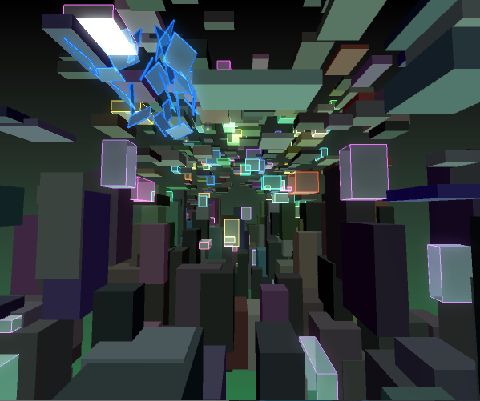
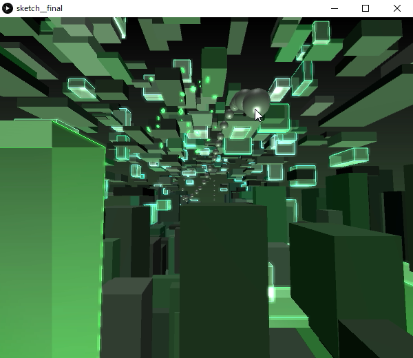
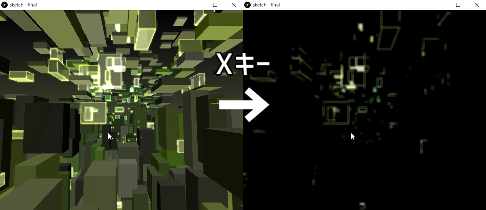

# InfinityGlassBreaker

[詳細(scrapboxのページに飛びます)](https://scrapbox.io/pfas/InfinityGlassBraker)

講義の自由課題で作成した3DCGのプログラムです。

## 操作方法
- `マウス左クリック`：ボールを投げる
- `Space`：ボールを連投する
- `X`：長押しでブルームエフェクトの合成用レイヤーを表示(ブルームのエフェクトをかけている場合のみ)

## シーン設定
ソースコード冒頭の変数を調節することで、以下の設定ができます。
- 色相の変化速度
- 視野
- 箱の出現範囲
- 箱の出現密度
- カメラ速度
- カメラ位置
- ボール
  - サイズ
  - 投擲力
  - 色
  - 連投する為のキー(デフォルトではSpace)
  - 連投時のクールタイム
- 破壊時の破片
  - 破片サイズ
  - 破片飛び散り速度
- フィルターの有無
- フィルターの種類(Processingデフォルトのブラー、OpenCVのブラー)
  - `usingFilterMode == 1`：Processingデフォルト。重い代わりに綺麗
  - `usingFilterMode == 2`：OpneCVのブラー。粗い代わりに軽い
- ブラーの強度

### プログラムの文字化け
元々日本語でコメントを書いていましたが、データ移行したためか日本語に復元できなくなりました……

